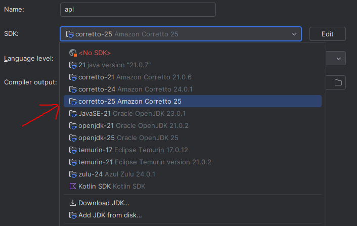
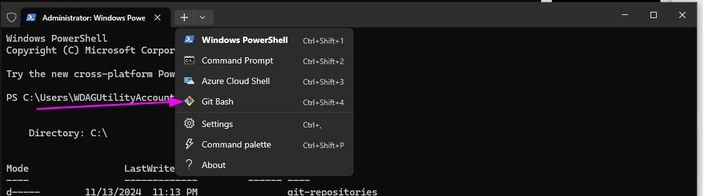
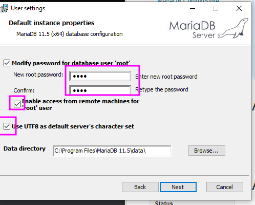
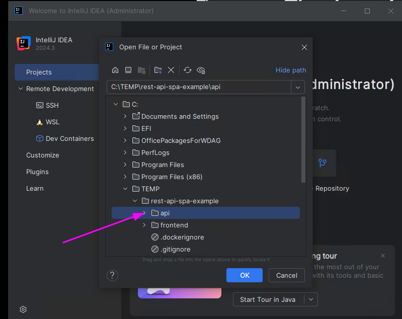
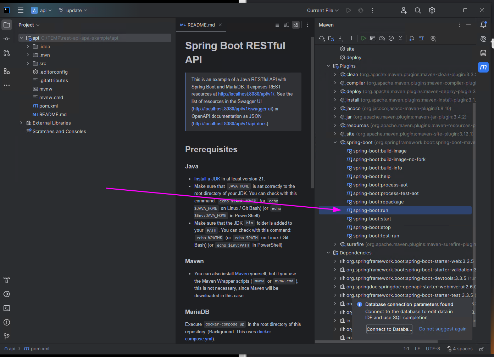

# ToDo Webanwendung (PE2 Projekt)

[](https://github.com/daniilperkin-uni/pe2_todo_app/actions/workflows/build.yaml)
[](https://github.com/daniilperkin-uni/pe2_todo_app/actions/workflows/lint.yaml)

Full-Stack-Webanwendung zur Verwaltung von ToDos und Assignees.
Ein Spring Boot Backend stellt eine REST API bereit, ein Vue 3 Frontend (SPA) nutzt sie.
Mit Docker Compose läuft alles inklusive MariaDB mit einem Befehl.

## Features

- ToDos und Assignees verwalten (CRUD), filtern, sortieren und als CSV exportieren
- Kanban-Status (`OPEN`, `IN_PROGRESS`, `DONE`)
- Wiederkehrende ToDos (`WEEKLY`, `MONTHLY`): beim Abschließen entsteht das nächste ToDo
- Statistiken: Abschlussquote, durchschnittliche Dauer, Verteilung nach Priorität, Kategorie und Assignee
- Klassifikator: ein PMML-Modell ordnet jedes ToDo `work` oder `private` zu
- Prioritäts-Feedback: Korrekturen werden gespeichert und ausgewertet
- Health- und Prometheus-Endpunkte über Spring Boot Actuator

## Technologien

- **Backend:** Spring Boot 4.1, Java 21, Maven, springdoc-openapi 3, JPMML, MariaDB (Laufzeit), H2 (Tests)
- **Frontend:** Vue 3, TypeScript, Vite, Vue Router, AgnosticUI, Vitest, ESLint
- **Betrieb:** Docker, Docker Compose, Nginx

## Schnellstart mit Docker Compose

```bash
docker compose up --build
```

Das startet MariaDB, das Backend und Nginx mit dem gebauten Frontend.
Die App läuft dann unter <http://localhost>, die API unter `http://localhost/api/v1/...`.
Daten bleiben über `docker compose down` / `up` hinweg erhalten.

## Lokale Entwicklung

Voraussetzungen: JDK 21, Node.js 22 und Docker (für MariaDB).

```bash
docker run -d --name pe2-mariadb -p 3306:3306 \
  -e MARIADB_ROOT_PASSWORD=root -e MARIADB_DATABASE=pe2 mariadb:latest
cd api && ./mvnw spring-boot:run        # http://localhost:8080
cd frontend && npm install && npm run dev  # http://localhost:5173
```

Der Vite-Dev-Server leitet `/api` an `http://localhost:8080` weiter (`frontend/vite.config.ts`).
Die OpenAPI-Dokumentation liegt unter <http://localhost:8080/swagger-ui>.

## REST API

Alle Pfade liegen unter `/api/v1`.

| Methode | Pfad | Beschreibung |
| --- | --- | --- |
| `GET`, `POST` | `/assignees` | Assignees auflisten / anlegen |
| `GET`, `PUT`, `DELETE` | `/assignees/{id}` | Assignee lesen / ändern / löschen |
| `GET`, `POST` | `/todos` | ToDos auflisten / anlegen (mit Klassifikation) |
| `GET`, `PUT`, `DELETE` | `/todos/{id}` | ToDo lesen / ändern / löschen |
| `PATCH` | `/todos/{id}/status` | Kanban-Status setzen |
| `GET` | `/todos/stats` | Statistiken |
| `POST` | `/todos/priority-corrections` | Prioritätskorrektur speichern |
| `GET` | `/todos/priority-corrections/stats` | Korrekturstatistik |
| `GET` | `/csv-downloads/todos` | CSV-Export |

## Qualitätsprüfungen

```bash
cd api && ./mvnw verify   # Tests, Checkstyle (PE2CheckStyle.xml), JaCoCo >= 80 %
cd frontend && npm ci && npm run lint:ci && npm run type-check && npm test && npm run build
```

Die gleichen Prüfungen laufen in GitHub Actions (`.github/workflows`).

## Screenshots der Einrichtung

| JDK (Corretto 25) | Git Bash | MariaDB |
| --- | --- | --- |
|  |  |  |

| `api`-Verzeichnis | Spring Boot Start |
| --- | --- |
|  |  |

## Lizenz

Siehe [LICENSE](LICENSE).
